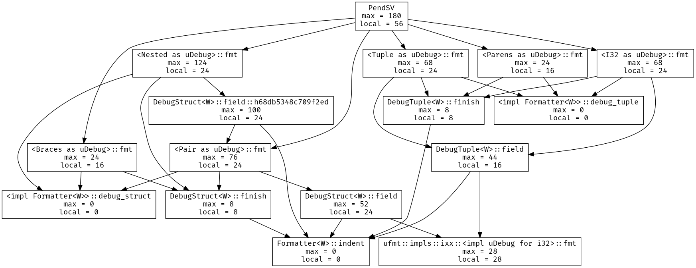

# `μfmt`

> A (6-40x) smaller, (2-9x) faster and panic-free alternative to `core::fmt`



Call graph of a program that formats some structs (generated using
[`cargo-call-stack`]). Source code can be found at the bottom of this file. The
program was compiled with `-C opt-level=z`.

[`cargo-call-stack`]: https://crates.io/crates/cargo-call-stack

## [API docs](https://docs.rs/ufmt)

## Design goals

From highest priority to lowest priority

- Optimized for binary size and speed (rather than for compilation time)

- No trait objects

- No panicking branches when optimized

- No recursion (if / where possible)

## Features

- `Debug` and `Display`-like traits

- `core::write!`-like macro

- A generic `Formatter<'_, impl uWrite>` instead of a single `core::Formatter`;
  the `uWrite` trait has an associated error type so each writer can choose its
  error type. For example, the implementation for `std::String` uses
  `Infallible` as its error type.

- `core::fmt::Formatter::debug_struct`-like API

- `#[derive(uDebug)]`

- Pretty formatting (`{:#?}`) for `uDebug`

# Minimum Supported Rust Version (MSRV)

Rust 1.34 for everything but the `uwrite!` macro which requires the unstable
`proc_macro_hygiene` feature at call site and thus nightly. However, it's
possible to use the stable `Formatter` API instead of `uwrite!`.

## License

All source code (including code snippets) is licensed under either of

- Apache License, Version 2.0 ([LICENSE-APACHE](LICENSE-APACHE) or
  [https://www.apache.org/licenses/LICENSE-2.0][L1])

- MIT license ([LICENSE-MIT](LICENSE-MIT) or
  [https://opensource.org/licenses/MIT][L2])

[L1]: https://www.apache.org/licenses/LICENSE-2.0
[L2]: https://opensource.org/licenses/MIT

at your option.

The written prose contained within the book is licensed under the terms of the
Creative Commons CC-BY-SA v4.0 license ([LICENSE-CC-BY-SA](LICENSE-CC-BY-SA) or
[https://creativecommons.org/licenses/by-sa/4.0/legalcode][L3]).

[L3]: https://creativecommons.org/licenses/by-sa/4.0/legalcode

### Contribution

Unless you explicitly state otherwise, any contribution intentionally submitted
for inclusion in the work by you, as defined in the Apache-2.0 license, shall be
licensed as above, without any additional terms or conditions.

## Appendix

### Formatting structs (snippet)

Full source code in [nopanic/examples/struct.rs](nopanic/examples/struct.rs).

``` rust
// ..

#[derive(Clone, Copy, uDebug)]
struct Pair {
    x: i32,
    y: i32,
}

static X: AtomicI32 = AtomicI32::new(0);
static Y: AtomicI32 = AtomicI32::new(0);

#[exception]
fn PendSV() {
    let x = X.load(Ordering::Relaxed);
    let y = Y.load(Ordering::Relaxed);

    uwrite!(&mut W, "{:?}", Braces {}).unwrap();
    uwrite!(&mut W, "{:#?}", Braces {}).unwrap();

    uwrite!(&mut W, "{:?}", Parens()).unwrap();
    uwrite!(&mut W, "{:#?}", Parens()).unwrap();

    uwrite!(&mut W, "{:?}", I32(x)).unwrap();
    uwrite!(&mut W, "{:#?}", I32(x)).unwrap();

    uwrite!(&mut W, "{:?}", Tuple(x, y)).unwrap();
    uwrite!(&mut W, "{:#?}", Tuple(x, y)).unwrap();

    let pair = Pair { x, y };
    uwrite!(&mut W, "{:?}", pair).unwrap();
    uwrite!(&mut W, "{:#?}", pair).unwrap();

    let first = pair;
    let second = pair;
    uwrite!(&mut W, "{:?}", Nested { first, second }).unwrap();
    uwrite!(&mut W, "{:#?}", Nested { first, second }).unwrap();
}

// ..
```
